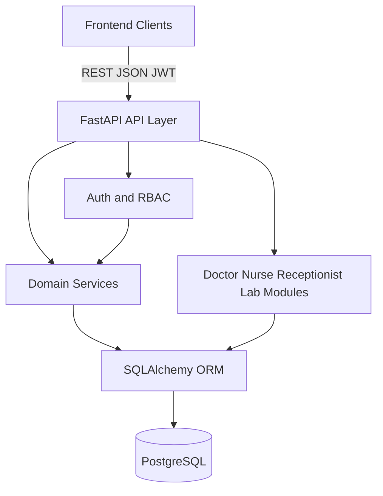

# Architecture Diagram

## Notes

- Routers stay thin; business logic lives in services  
- Auth/RBAC gates protected operations before services run  
- ORM isolates PostgreSQL details from API handlers  
