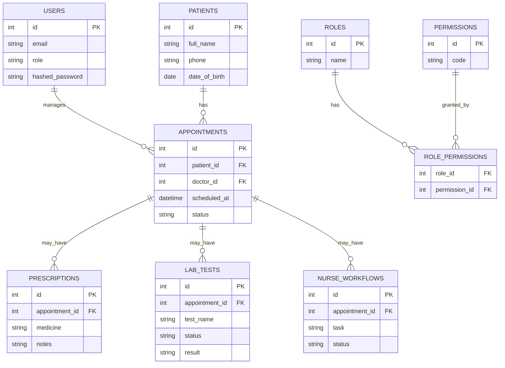

# Database ER Diagram (Simplified / Sanitized)

```mermaid
erDiagram
  USERS ||--o{ APPOINTMENTS : manages
  USERS {
    int id PK
    string email
    string role
    string hashed_password
  }

  PATIENTS ||--o{ APPOINTMENTS : has
  PATIENTS {
    int id PK
    string full_name
    string phone
    date date_of_birth
  }

  APPOINTMENTS ||--o{ PRESCRIPTIONS : may_have
  APPOINTMENTS ||--o{ LAB_TESTS : may_have
  APPOINTMENTS ||--o{ NURSE_WORKFLOWS : may_have
  APPOINTMENTS {
    int id PK
    int patient_id FK
    int doctor_id FK
    datetime scheduled_at
    string status
  }

  PRESCRIPTIONS {
    int id PK
    int appointment_id FK
    string medicine
    string notes
  }

  LAB_TESTS {
    int id PK
    int appointment_id FK
    string test_name
    string status
    string result
  }

  NURSE_WORKFLOWS {
    int id PK
    int appointment_id FK
    string task
    string status
  }

  ROLES ||--o{ ROLE_PERMISSIONS : has
  PERMISSIONS ||--o{ ROLE_PERMISSIONS : granted_by
  ROLES {
    int id PK
    string name
  }
  PERMISSIONS {
    int id PK
    string code
  }
  ROLE_PERMISSIONS {
    int role_id FK
    int permission_id FK
  }
```

This is a **simplified portfolio view**, not a dump of the full production schema.
